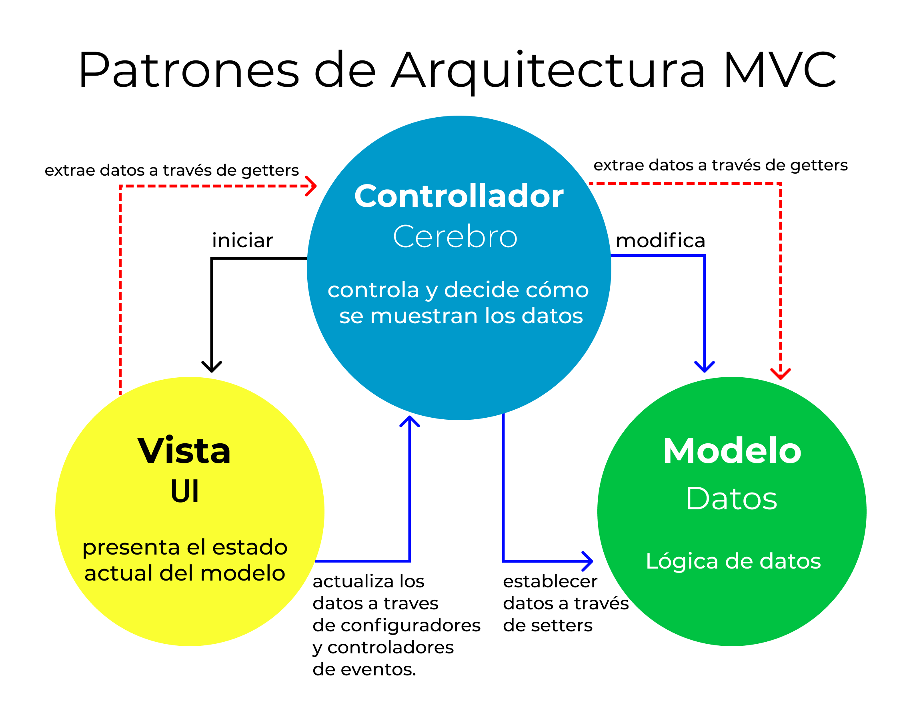

# Empezando con NODE

## Creando mi primer proyecto NPM

```sh
npm init -y # -> flag -y permite ponerle yes a todas las opciones del menú interactivo.
```

```sh
touch README.md server.js 
```

## NODEMON: Reload para NODE

<https://www.npmjs.com/package/nodemon>

```sh
npm i nodemon -D # -D -> como dependencia de desarrollo
```

Me permite mientras estoy desarrollando, ver los cambios en vivo.

> package.json

```json
  "scripts": {
    "start": "node server.js",
    "dev": "nodemon server.js" // Agrego este script
  },
```
```sh
npm run dev
```

## Listar los diferentes scripts

```sh
npm run
```

## Detener el servidor de desarrollo de Node

(Ctrl) + C

## Framework express para crear un servidor Web (Más fácil)

<https://expressjs.com/es/>

# Importar y exportar modulos

* CommonJS modules (require y export)
* ES Modules (import y export)

## Para utilizar los modulos modernos de trabajo con JS

> package.json

```json
"type": "module",
```

Luego trabajar normalmente como lo veniamos haciendo con React.


## Patrón MVC Arquitectura




